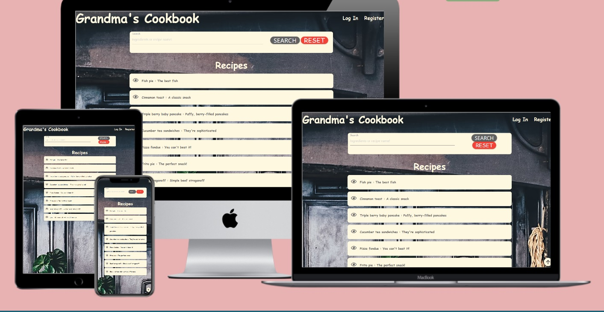
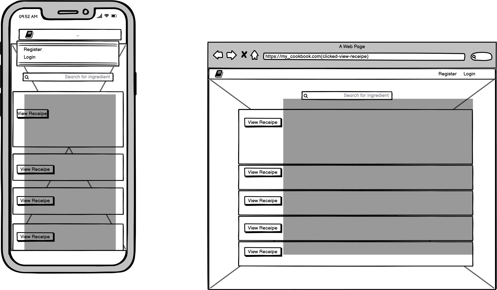
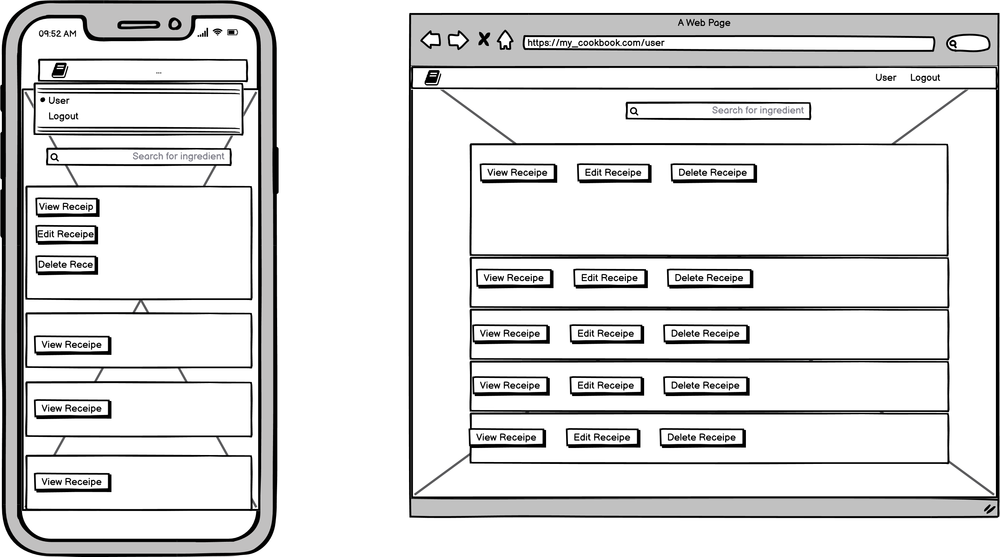
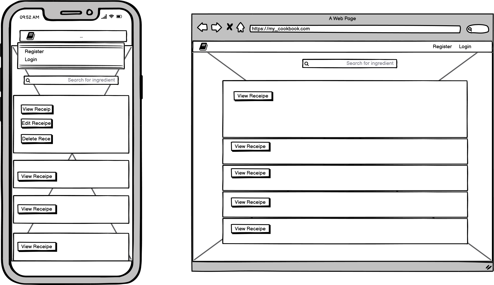

# Grandma's Cookbook

## Introduction

Experience Grandma's Cookbook, a easy to use recipe website, giving everyone access to their favorites just a few clicks away. 
A safe and responsive website to provide you with the tools needed to try out your old favorite recipe.  Add your own and share the love.

## Contents
1. [UX](#UX)
2. [Design Decisions](#Design-Decisions)
3. [Database](#Database)
4. [Features](#Features)
5. [Technologies](#Technologies)
6. [Testing](#Testing)
7. [Testing Bugs](#Testing-Bugs)
8. [Deployment](#Deployment)
9. [Credits](#Credits)
11. [Disclaimer](#Disclaimer)

## UX

This website have been designed to give any visitors easy access to all of it's content without needing to signup,
 but provides the opportunity to register and contribute with their favorite recipe for the other fellow members.
  With the built in administrator portal, allowing for easy management  process for each recipe.
Making all content available to the visitor upon accessing the page. 

### User Stories

- 1. Want to use it as my own digital recipe book for easy sharing. 

- 2. Quick access to recipes for cooking that is easy to follow.

- 3. Want to add and edit my own recipe to help others cook my recipes.

- 4. I want the recipe listing feature to be searchable, so I can search for specific recipes I may be interested in.

- 5. I want an easy way to login or signup to the website.

### Usage 
Design decision that allow visitors, users, and administrator to access the entire page, and all CRUD functionality 
(Create, Read, Update and Delete) within as few clicks as possible, yet get to experience the entire platform for ease
of use.

### Smart Search
Built in Search comodity to manage the content on the website , allowing content to be found by searching for key ingredient,
 providing the visitor a quick overview and an easy to use website.

## Design Decisions
The design follows a minimalistic approach by only displaying content that is of value to the visitor, 
and keeping any overflow out of the design process, and relying heavily on dynamic user content. 
The Grandma's Cookbook takes much inspiration from the project Task-Manager from Coding Institute
Grandma's Cookbook uses light vintage like  colors, to have a clear contrast with the websyte vintage theme  to enhance 
overall visibility, and minimizing bombarding the visitors with colors, but rather finding the appropriate places to apply them.

### WireFrames

First page

LogedIn page

Logout page

### Typography
I choose to use Cursive  for the text  due to it's vintage looks and give the page a bit more personality  also not too vintage
 ( like Yesteryear) to help with readability.

## Database
This website have 2 databases, 1 for users and 1 for recipes, these are both being used to connect with each other as
 well being used to store various calculations, and store all general information on the page. All the content on the page is 
 generated from these 2 databases.

User Database

| ID       	| db generated id 	|
|----------	|-----------------	|
| Name     	| String          	|
| Password 	| String/Hashed   	|

Recipe Database

| ID       	  | db generated id 	|
|------------ |-----------------	|
| Name     	  | String          	|
| Description | String  	        |
| Image       | String              |
| Ingredients | String  	        |
| Portions    | String  	        |
| How_to      | String  	        |
| Author      | String  	        |

#### User database explained

- Username: Stores the chosen username added by the user.
- Password: Is a hashed password, so no password is in clear text inside the database.

#### Recipe database explained.

- Name: Is what the user choose to call the recipe.
- Description: This is where you can type a small text to "sell" your recipe.
- Image: The user adds the url of an image of the receipe.
- Ingredients: The user inputs all ingredients to use.
- Portions: Added by user, simply how many portions added the recipe contains.
- How_to: User input of the cooking method for the recipe.
- Author: Input from session .

## Features
All the features were developed with dynamic user content with appropriate restrictions. Features like create, update, delete, 
 are hidden behind a registration wall or login portal, but this do not hinder visitors from viewing the overall content.

### Home Page (visitor)
The home page includes Log In and Registration menu at the very top, where all the highest rated recipes comes into view with the 
option to search recipes by indredient or name. 

### Home Page (Registered/logged in)
After logging in a few new features appear, the header will now show Logout and your username and Add recipe 

### Home Page ( common )
Visitors, Registered users and administrator can see all the recipes in a accordeon style that expands to show the ingredients, 
number of portions and the author, click on the "Cook" button opens a modal with the instructions to cook the recipe.

### Administrator Profile (logged in)
This page allows you to see every recipe and a new link to "Manage Recipes" for quick edit or delete. 

### Add Recipe (Only available when logged in)
This can be found as a menu link once logged in on the home page.
Allowing the user to add their own recipe name, description text, portions, ingredients and the steps to make a recipe.
This page looks the same for user and administrator

### Edit Recipe (Only available when logged in and author of the recipe or admin inside the recipe accordeon )
Provides identical user interface as add recipe, but pulls all the data from the database to be edited 

### Features I want to implement
In time of development, I noticed multiple important features that should be added for the complete experience,
 but they are not necessary for the project to be completed and was left to be implemented later because of time constraints.
  Will be added after submision and grading:
 - email on registeration

## Technologies
### Languages

- HTML:	Creating the entire foundation for the website.
- CSS :	Applying styling across all pages.
- JavaScript	Add logic rules to all input forms and buttons.
- Python	Runs the entire backend server 

### Libraries
- Materialize:  Styling Framework to get a modern feel to the website.
- Font Awesome:	Used for all website icons.
- jQuery:	Simplifying some of the get id's for Javascript.
- Google Fonts:	For all fonts on all pages.

### Python Libraries
- Flask:	Required to run all route operations in the code.
- OS:	Required to read environmental variables.
- flask_pymongo:	Most search queries requires pyMongo to operate in the code.
- bson:	Required to acquire the object ID of the different data-sets.
- werkzeug.security	Required to operate hash for secure passwords.

### Database
- MongoDB	Store all content for the database for recipes and users.

## Testing
Due to all the features on the website, the testing have been broken up in multiple sections, each covering testing 
such as Intended use, Features, Responsiveness, Security and Code Testing, as well as Feedback. After all the tests 
there will be a summary section for a quick overview over all passed tests and bugs found. All tests will be preformed 
in Chrome, Firefox, and Edge on Desktop, and native IOS browser.

### I have tested the following

- Intended use/ User Stories (Interactivity)
- Responsiveness across devices
- W3 HTML Validator using URL and copy/paste code
- W3 CSS Validator
- JS Hint
- PEP8
- Lighthouse ( google dev tools)
### Intended Use / User Stories on Chrome, Firefox and Edge (Interaction)
#### User Story 1 - I want to use it as my own digital recipe book for easy sharing. 
 - The title of the site gives an idea of its purpose.
 - The homepage displays a suitable hero image.

#### User Story 2 - Quick access to recipes for cooking that is easy to follow.
 - On the homepage all the recipes are presented with images inside an accordeon layout to make it easi to see multiple recipes at first glance.
 - Clicking on "info" inside the recipe accordeon opens a modal with the cooking instructions.
 - Clicking on a recipe  will open the accordeon to recipe with all the info inside.

#### User Story 3 - I want to add and edit my own recipe to help others cook my recipes.
 - Buttons for these functions have been included on the profile page and on the homepage on the recipes posted by the logged in user.
 - Edit/Delete recipe buttons placed below individual recipe  to make it easy to select recipe for editing/deleting.
 - Add Recipe also appears on the navbar (once user is logged in).
 - Edit Recipe form has existing recipe details pre-filled in form to make it easier for user to edit.
 - Form input requirements are kept simple, and clear instructions provided regarding input requirements displayed on form.

#### User User Story 4 - I want the recipe listing feature to be searchable, so I can search for specific recipes I may be interested in.
 - Clear search function at top of recipes page, enabling searching by recipe title/ingredients.

#### User Story 5 - I want an easy way to login or signup to the website.
 - Two simple pages for these functions, where only two inputs are required, and clear instructions displayed regarding the requirements for these inputs.

#### Landing Page (Not logged in / visitors )
- Opening website on full screen expecting all images, icons, labels to be displayed with correct ratio.
- Clicking on a recipe  expecting it to open the accordeon to recipe correctly.
- Clicking on "info" inside the recipe accordeon opens a modal with the cooking instructions.
- Clicking Login to redirect me to login page.
- Clicking Register to redirect me to registration page.

#### Recipe Page(Not logged in / visitors)
- Opening Recipe , expecting all icons, text to display correctly.
- Clicking on login to redirect me to login page.
- Clicking on register to redirect me to registration page page.
- Clicking "Grandma's Cookbook" get redirected to main landing page.

#### Registration Page(Not logged in / visitors)
- Attempted putting in 1 letter into username, and left password  blank Expecting feedback on all input boxes.
- Attempted putting in 1 letter into username,  and add too short password Expecting feedback on all input boxes.
- Fixed username to 3 letters, left  password  too short still block user from register.
- Fixed password , Confirm password left blank Expecting feedback on Confirm Password.
- Input Confirm password different from Password Expecting flash " Password don't match!"
- Fixed password and Confirm password, now all registration rules are correct, allowing user to register, Expecting flash " Registration complete"

#### Login Page
- Typed in username only and click login, asked for password.
- Typed in username and wrong password, -expected feedback, username and/or password incorect
- Typed in only password, but no username, was informed to type in username too.
- Typed in correct username and correct password, website allowed me to login.
- When logged in successfully, expecting the page to redirect user to landing page.

#### Landing Page(Logged in / contributor )
- Expecting the navigation bar to no longer have Login and Register, but Logout Username  and Add recipe

#### Recipe Page(Not author, but Logged in)
- Visiting Recipe page that my user have not made, expect to not see edit or delete buttons.
- view recipe correctly.
- Clicked website name to redirect to main page.
#### Recipe Page(author, and Logged in)
- Visiting recipe page as author, expecting to see delete button and edit button 
- Clicking edit button redirect user to update page correctly.
- Clicking delete button, delete the recipe and redirect user to main page.

#### Admin Login (only accessible when logged in as Administrator-Manage Recipes page)
- Clicking delete will remove any recipe from database.
- Clicking Edit will redirect to edit_recipe.html

#### Create new recipe(Only accessible logged in)
- Attempting to submit the form empty, expecting to receive error message across the whole form.
- Adding 1 letter in recipe name, but is told it's too short.
- Adding more then 3, and get approved.
- Adding letters into portions,  also more than 2 numbers not passing the validation, informs user to add a number 1-99
- Adding number works.
- Adding ingredients, anything less then 5 characters will inform user it's too short.
- Adding How To steps, anything less then 8 characters will inform the user it's too short.

## Testing Bugs
- when trying to register with a wrong length password the user was asked to correct the submisionbut wasn't informed
on the conditions needed, Fixed
- the flash message was not responsive, updated to a responsive text size
- the google lighthouse found some performance issues regarding readability of label font and size, Fixed
- found errors on the modal name in w3c validator - Fixed
- found warnings in w3c validator for section heading - Fixed
- the background image was fixed to 150vh showing only on half page on mobile - Fixed

## Deployment
The following steps will explain how you can get the website running on heroku and locally with just a few steps.

 ### Tools required to be installed
- Python 3 (Pip 3 comes installed by default)
- Git
-Heroku CLI

### How to Clone and set up the website locally in a few steps
1. Clone website
    - Go to [GitHub](www.github.com)
    - Click search .
    - Locate mihai-busuioc/grandmas-cookbook
    - Open grandmas-cookbook
    - Click the green button clone to download.
    - Or clone from URL using the following command in terminal: got clone https://github.com/mihai-busuioc/grandmas-cookbook.git

2. Installing Requirements.
Once you have the project cloned on your computer, you are ready to set everything up.

- Open the Terminal and navigate to grandmas-cookbook folder on the computer.
- Install the libraries from requirements.txt by typing pip3 install -r requirements.txt

3. Setting up the database keys
Once the project is cloned, and you have the libraries installed from requirements.txt, we can now set up the database.
Create a python file called env.py, and place it outside of the folder structure, next to run.py.
Inside the newly created env.py file, you need to add information to 2 variables and 1 import.
At the top of env.py add the following lines :
- import os
- blank line
- os.environ.setdefault("IP", "0.0.0.0")
- os.environ.setdefault("PORT", "5000")
- os.environ.setdefault("SECRET_KEY", "your_secret_key_here")
- os.environ.setdefault("MONGO_URI", "mongodb+srv://<USERNAME>:<PASSWORD>@<CLUSTER>-4g3i1.mongodb.net/<DATABASE>?retryWrites=true&w=majority")
- os.environ.setdefault("MONGO_DBNAME", "your DB name")

4. Running the app locally 

- Run python3 run.py
- Paste http://127.0.0.1:5000/ into your browser URL to access.

### Deploy Grandma's Cookbook on Heroku
Before beginning this step, you need to complete the above step 1. Clone Website.

1. Setting up Heroku
- Create an account on [Heroku](heroku.com).
- Click New button, then Click Create new app.
- Give it a name and choose your region.
- Click Create App.
- Find your App name on the dash board, and enter.
- Click Settings, and locate Config Vars, and fill in like shown below (Just edit out the placeholder text).
- Key	Value
- IP	0.0.0.0
- PORT	5000
- MONGO_URI	"mongodb+srv:......"
- MONGO_DBNAME	Name of the database
- SECRET_KEY	"Secret key you made for local"
2. Setting up our files
At this stage, go back to your IDE, we are now setting everything up for pushing to Heroku.

- If the Procfile is missing, please preform the following command in your terminal echo web: python3 run.py > Procfile
- If the requirements.txt is missing, please preform the following command in your terminal pip3 freeze > requirements.txt
3. Deploy to Heroku
- In your Terminal type heroku login.
- Then git push heroku master .
- Open Heroku website.
- Navigate to the app (Grandma's Cookbook), and click Open App, and now everything should be running.

## Credits
Big shout out to my mentor [Adeye Adegbenga](https://github.com/deye9) who made everything fall into place on the inception of the project meeting, this made the entire 
project completely understandable and everything else that followed was much easier.

Also thanks to the Code Institute lessons i was able to put this in practice part of the project is taken from the 
lessons, and tweaked to some degree.

A huge shout out to igor_ci in the Tutor session that provided some great input on the challenge I had with the modal id not comming on because of the  double 
for loop. Helped me a ton. Just the eyes i needed.

### Images

- All  images are [by Annie Spratt](https://unsplash.com/@anniespratt?utm_source=unsplash&amp;utm_medium=referral&amp;utm_content=creditCopyText)  [on Unsplash ](https://unsplash.com/s/photos/vintage-kitchen?utm_source=unsplash&amp;utm_medium=referral&amp;utm_content=creditCopyText)

and are hosted free on [Cloudinary](https://cloudinary.com/)
- The logo from the readme file is cut and styled from  openculture.com
- Favicon from favicon-generator.org
- 

## Disclaimer
This project is for Educational purpose only

The assesor can create a "superadmin" user with all the admin powers .